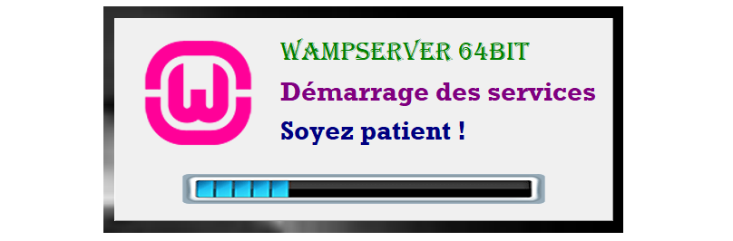
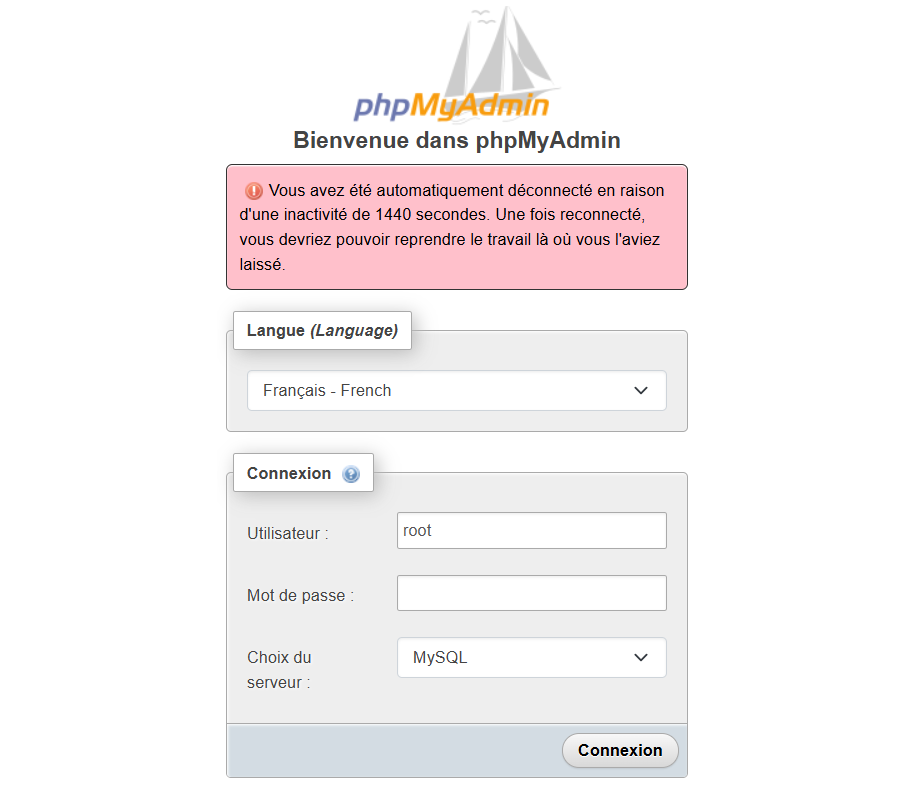
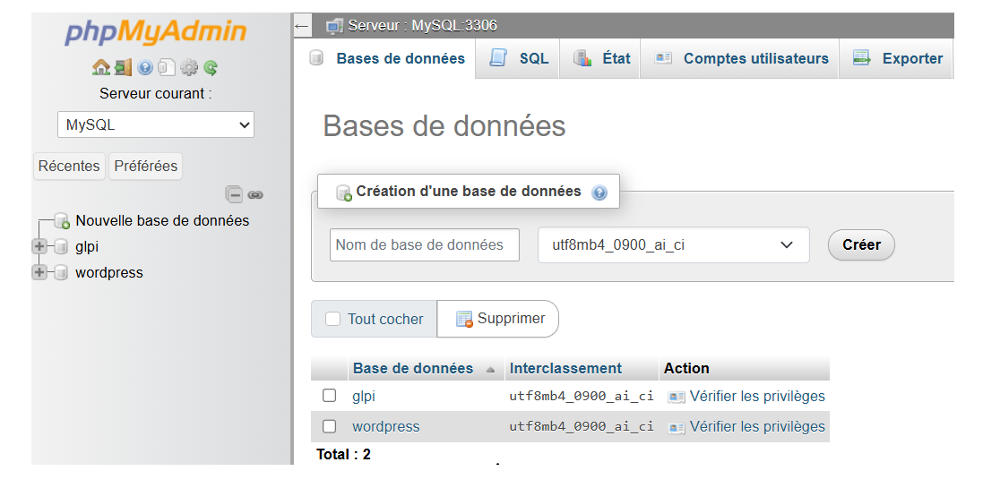
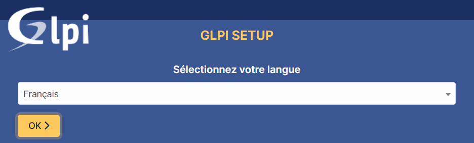
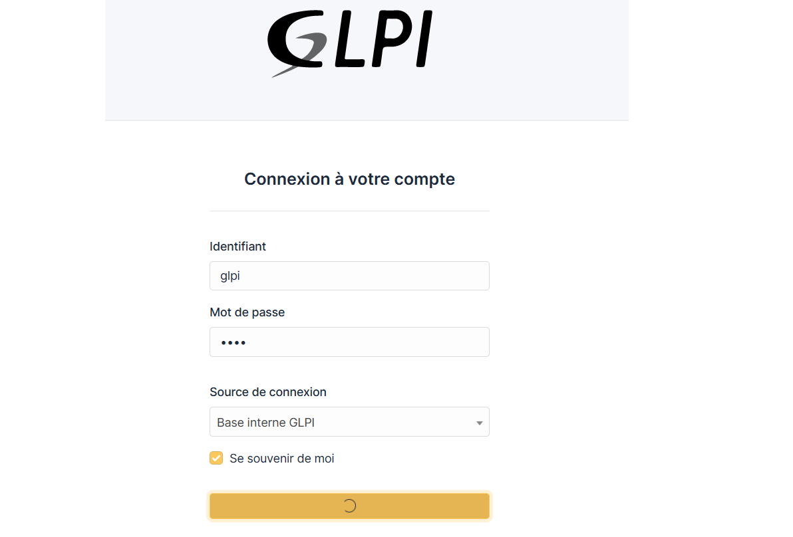
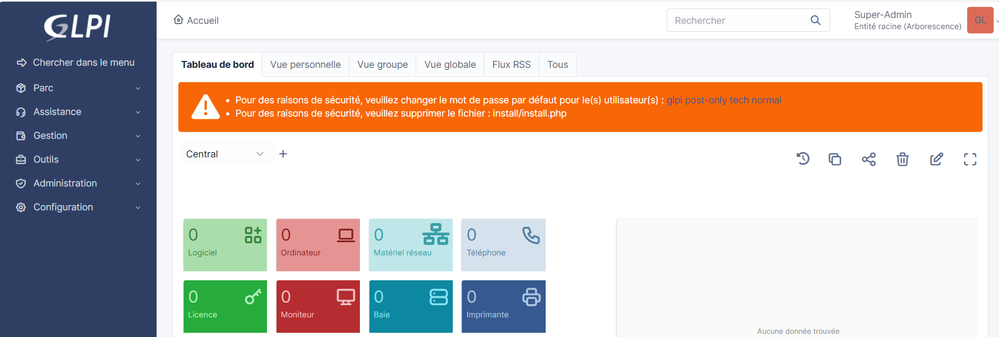

# Installation de GLPI avec WampServer

## Description
Ce document décrit les étapes d’installation de GLPI pour le projet MDF.

## Télécharger et installer Serveur
- Télécharger WampServer : https://www.wampserver.com
- Installation sur Windows et choix du répertoire (par défaut c:\wamp64) 
- Télécharger les packages Microsoft Visual C++ : https://wampserver.aviatechno.net

## Configuration base de donnée
- Démarrer WampServer

- Accéder à `http://localhost/Phpmyadmin`

- Créer une base de données `glpi_db`.

## Télécharger GLPI
- Télécharger GLPI depuis le site officiel : https://glpi-project.org  
Version utilisée : GLPI 10.0.x

## Installer GLPI
- Décompresser et importer les fichiers GLPI dans `/wamp64/www/glpi`.
- Accéder à `http://localhost/glpi`.

- Connexion à glpi (identifiant : glpi, mot de passe : glpi).

## Post installation
Voici les actions urgentes à effectuer pour sécuriser glpi :
- Modifier le mot de passe par défaut : GLPI crée automatiquement des comptes (administrateur, technicien, utilisateur standard, utilisateur limité) avec des mots de passes standards (glpi, tech, normal, post-only).
- Supprimer le fichier install/install.php dans le répertoire glpi.
- Sécuriser le dossier racine du serveur web : GLPI signale que le serveur permet l'accès à des fichiers publics. Pour corriger cela, on s'oriente vers le répertoire `wamp64/www/glpi/src/system/requirement/SafeDocumentRoot` puis on ajoute dans ce fichier `return;`.
- Activer la directive PHP session.cookie_httponly : Cette directive empèche les scripts Javascript d'accéder aux cookies de session. Dans le  fichier Php.ini, ajouter ou modifier
`session.cookie_httponly = 1`.

