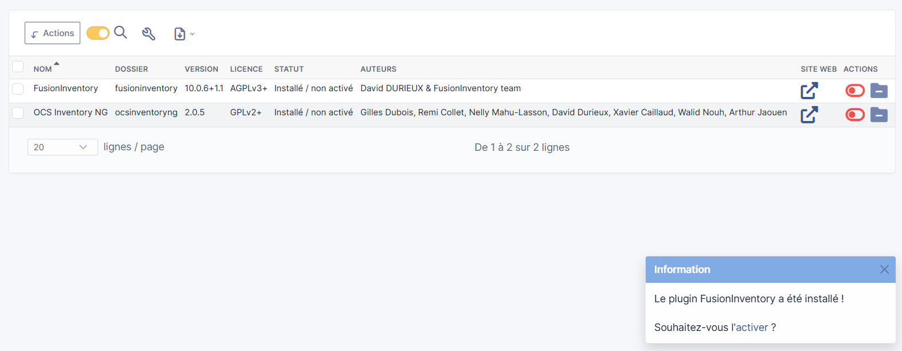

# Installation de GLPI

## Description
Ce document décrit les étapes utiliser pour l'installation de GLPI.

---

## Outils utilisés
- WampServer (PHP version 7.4.33)
- GLPI version 10.0.6
- OCS Inventory NG version 2.0.5
- Fusion Inventory Version 10.0.6 + 1.1

---

## Télécharger et installer WampServer
- Télécharger WampServer : https://www.wampserver.com
- Installation sur Windows et choix du répertoire (par défaut c:\wamp64) 
- Télécharger les packages Microsoft Visual C++ : https://wampserver.aviatechno.net

---

## Configuration base de donnée
- Démarrer WampServer.
- Accéder à `http://localhost/Phpmyadmin`.

- Créer une base de données `glpi`.

- Créer une base de données `ocs`.

---

## Télécharger et installer GLPI
- Télécharger GLPI depuis le site officiel : https://www.glpi-project.org/en/new-version-glpi-10-0-6/  
- Décompresser et importer les fichiers GLPI dans `/wamp64/www/glpi`.
- Accéder à `http://localhost/glpi`.
- Connexion à glpi (identifiant : glpi, mot de passe : glpi).

- Affichage du tableau de bord glpi.

---

## Post installation
Voici les actions urgentes à effectuer pour sécuriser glpi :
- Modifier le mot de passe par défaut : GLPI crée automatiquement des comptes (administrateur, technicien, utilisateur standard, utilisateur limité) avec des mots de passes standards (glpi, tech, normal, post-only).
- Supprimer le fichier install/install.php dans le répertoire glpi.

---

## Télécharger et installer plugins (OCS Inventory NG, Fusion Inventory Version)
- Télécharger OCS Inventory NG sur GitHub : https://github.com/fusioninventory/fusioninventory-for-glpi/releases
- Télécharger Fusion Inventory sur GitHub : https://github.com/pluginsGLPI/ocsinventoryng/releases/tag/2.0.5
- Décompresser et importer les fichiers plugins dans `/wamp64/www/glpi/plugins`.
- Installer et activer les plugins sur GLPI.

