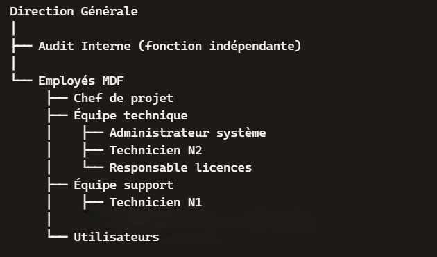

# Projet 1 : Gestion du parc informatique MDF

## Contexte
Dans le cadre d'un projet fictif, une gestion du parc informatique a été réalisé pour la société MDF. MDF (Sales and Marketing) est une société spécialisée dans l’externalisation commerciale et marketing, fondée en 2005 et basée à Asnières-sur-Seine (Île-de-France). Elle accompagne les grandes marques et les PME dans le développement de leur présence sur le marché, en proposant des solutions terrain et digitales adaptées aux besoins de chaque client.  

## Objectif principal 
Mettre en place une gestion efficace et sécurisée du parc informatique de MDF.

## Missions
- Centraliser l’inventaire matériel et logiciel,
- Gérer les habilitations via Active Directory,
- Suivre et résoudre les incidents avec GLPI,
- Assurer la sauvegarde régulière sur Azure.

## Arborescence de l'organisation

Le schéma de l'organisation illustre les interactions suivantes :
- Les utilisateurs remontent leurs besoins/incidents vers l’équipe support.
- L’équipe support transmet les problèmes récurrents à l’équipe technique.
- Le chef de projet coordonne l’ensemble et assure le lien avec la direction.
- L'audit interne évalue objectivement les pratiques, contrôle les risques, vérifie la conformité, pointe les failles sans conflit d’intérêt.
- La direction générale est le centre de pilotage de l’organisation.

## Quelques postes utilisateurs

| Postes                  | Responsabilités                 
|-------------------------|-----------------------------------------------------------------------------------------|
|Commercial terrain       |Prospection, vente directe, animation de points de vente, reporting d’activité           | 
|Responsable marketing    |Élaboration de campagnes, analyse de marché, coordination avec les équipes commerciales  |                                                                            
|Customer Success         |Suivi client, résolution de problèmes, fidélisation, support post-vente                  |                                                                     
|Stagiaire marketing      |Soutien aux campagnes, création de contenus, veille concurrentielle                      |

---

Copyright (c) 2025 FOUNA Peyroche Mercier De-Dieu