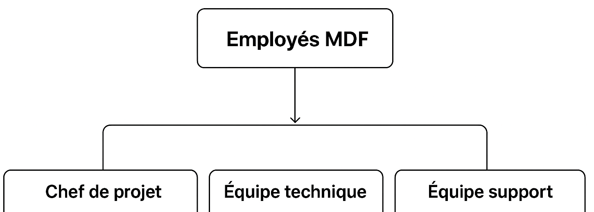

# Projet 1 : Gestion du parc informatique MDF

## Contexte
Dans le cadre d'un projet fictif, une gestion du parc informatique a été réalisé pour la société MDF. MDF (Sales and Marketing) est une société spécialisée dans l’externalisation commerciale et marketing, fondée en 2005 et basée à Asnières-sur-Seine (Île-de-France). Elle accompagne les grandes marques et les PME dans le développement de leur présence sur le marché, en proposant des solutions terrain et digitales adaptées aux besoins de chaque client.  

## Objectif principal 
Mettre en place une gestion efficace et sécurisée du parc informatique de MDF.

## Missions
- Centraliser l’inventaire matériel et logiciel,
- Gérer les habilitations via Active Directory,
- Suivre et résoudre les incidents avec GLPI,
- Assurer la sauvegarde régulière sur Azure.

## Schéma de l'organisation :

Le schéma de l'organisation illustre les interactions :
- Les employés remontent leurs besoins/incidents vers l’équipe support.
- L’équipe support transmet les problèmes récurrents à l’équipe technique.
- Le chef de projet coordonne l’ensemble et assure le lien avec la direction.

## Organisation :

1. Employés MDF

| Postes                  | Responsabilités                 
|-------------------------|-----------------------------------------------------------------------------------------|
|Commercial terrain       |Prospection, vente directe, animation de points de vente, reporting d’activité           | 
|Responsable marketing    |Élaboration de campagnes, analyse de marché, coordination avec les équipes commerciales  |                                                                            
|Customer Success         |Suivi client, résolution de problèmes, fidélisation, support post-vente                  |                                                                     
|Stagiaire marketing      |Soutien aux campagnes, création de contenus, veille concurrentielle                      |
|Développeur full stack   |Maintenance des outils internes, développement d’applications web                        |

2. Chef de projet

- Rôle principal : assurer la coordination générale du projet.

- Responsabilités : Planifier les tâches et répartir le travail entre les équipes, Suivre l’avancement et produire des reportings (rapports d’état, indicateurs), Garantir la cohérence entre les objectifs, les délais et les ressources, Servir de point de contact avec la direction ou les clients.

3. Équipe technique

- Rôle principal : gérer les aspects opérationnels et techniques.

- Responsabilités : Réaliser l’inventaire (matériel, logiciels, configurations), Effectuer les paramétrages et configurations nécessaires (GLPI, plugins, serveurs), Traiter les tickets techniques (incidents, demandes d’évolution), Assurer la maintenance et la mise à jour des systèmes.

4. Équipe support

- Rôle principal : être l’interface avec les utilisateurs finaux.

- Responsabilités : Suivre les incidents signalés par les utilisateurs, Communiquer clairement sur l’état des résolutions et les délais, Accompagner les utilisateurs dans l’utilisation des outils, Remonter les problèmes récurrents à l’équipe technique ou au chef de projet.

---

Copyright (c) 2025 FOUNA Peyroche Mercier De-Dieu